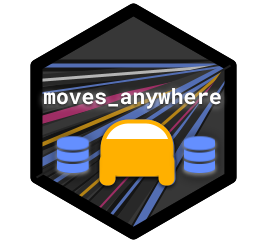

<head>
    <link rel="shortcut icon" type="image/png" href="extra/movesanywhere_hexagon.png">
</head>

# `moves_anywhere` 

-   Lead Developer: [Tim Fraser, PhD](github.com/timothyfraser) `<tmf77@cornell.edu>`
-   Contributors: Erin Murphy, Junna Chen, Mahak Bindal, Shungo Najima, Carl Closs
-   Institution: Gao Labs \@ Cornell University
-   Description: A Docker-based solution to run MOVES anywhere - on Windows, Mac, or Linux

## Welcome!

Welcome to `moves_anywhere`! This software suite includes several tools to help you run the Environmental Protection Agency's [MO]{.underline}tor [V]{.underline}ehicle [E]{.underline}missions [S]{.underline}imulator (MOVES) more easily. Developed by Tim Fraser and colleagues at Gao Labs at Cornell University, `moves_anywhere` aims to solve several common problems for planners, engineers, and researchers who need to know how many tons of emissions are produced from on-road transportation sources in their county or state. These problems include:

-   Writing `runspec.xml` documents faster (a recipe for your MOVES run)

-   Running MOVES on any OS (Windows, Mac, or Linux), using a Docker container.

-   Running MOVES with custom inputs when you have *some (or none)* of the required custom input tables, but not all.

-   Post-processing MOVES inventory output data into the more dataviz-friendly "CAT Format", developed for Cornell's Climate Action in Transportation (CAT) team's research.

-   Uploading CAT Formatted Data to a Google Cloud SQL server using a Docker container.

-   And more!

## Using this Repository

To get started, check out our guides in the `docs` folder, including:

-   [MOVES Anywhere Guide](docs/moves_anywhere_guide.md)
-   [Cloud MOVES Guide](docs/cloud_moves_guide.md)

Try out our demos in the `demos` folder! We encourage:

-   [Setting Up `moves_anywhere` on your computer](docs/moves_anywhere_setup.md)
-   [Installing the `catr` package](demos/demo_catr/workflow.R)
-   [Use `catr` to quickly make a custom runspec](demos/demo_rs/workflow.R)
-   [Run `moves_anywhere` on your local computer with Docker](demos/demo_docker/testme.sh)
-   [View Example Custom Input Tables](demos/demo_inputs)

For Cornell Research Team users, try:

-   [Make 1 `moves_anywhere` run on the cloud with Cloud MOVES](demos/demo_run/workflow.R)

-   [Make 1 `moves_anywhere` multi-year scenario on the cloud with Cloud MOVES](demos/demo_scenario/workflow.R)

## Stay Tuned!

More exciting developments coming soon!
