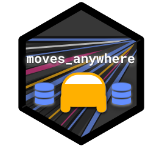
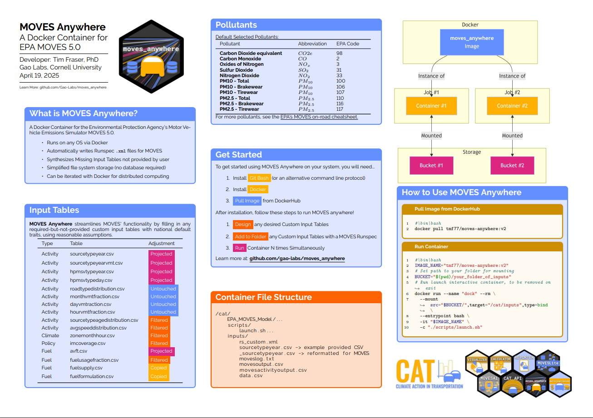

<head><link rel="shortcut icon" type="image/png" href="docs/img/movesanywhere_hexagon.png"></head>

# `moves_anywhere` <a href="https://github.com/gao-labs/movesanywhere"></a>

-   Lead Developer: [Tim Fraser, PhD](github.com/timothyfraser) `<tmf77@cornell.edu>`
-   Contributors: Erin Murphy, Junna Chen, Mahak Bindal, Shungo Najima, Carl Closs
-   Institution: Gao Labs \@ Cornell University
-   Description: A Docker-based solution to run MOVES anywhere - on Windows, Mac, or Linux

## Welcome!

Welcome to `moves_anywhere`! This software suite includes several tools to help you run the Environmental Protection Agency's [MO]{.underline}tor [V]{.underline}ehicle [E]{.underline}missions [S]{.underline}imulator (MOVES) more easily. Developed by Tim Fraser and colleagues at Gao Labs at Cornell University, `moves_anywhere` aims to solve several common problems for planners, engineers, and researchers who need to know how many tons of emissions are produced from on-road transportation sources in their county or state. These problems include:

-   Writing `runspec.xml` documents faster (a recipe for your MOVES run)

-   Running MOVES on any OS (Windows, Mac, or Linux), using a Docker container.

-   Running MOVES with custom inputs when you have *some (or none)* of the required custom input tables, but not all.

-   Post-processing MOVES inventory output data into the more dataviz-friendly "CAT Format", developed for Cornell's Climate Action in Transportation (CAT) team's research.

-   Uploading CAT Formatted Data to a Google Cloud SQL server using a Docker container.

-   And more!

## Using this Repository

📂 To get started, check out [our cheatsheet](https://github.com/gao-labs/movesanywhere/tree/main/docs/img/moves-anywhere-cheatsheet.png):



## Download the `catr` package using

Data processing in **MOVES Anywhere** is supported by our `catr` package in `R`. 
Need to install `catr`?

✅ To install the latest from source:, use the \`remotes package.

``` r
remotes::install_github("Gao-Labs/moves_anywhere", subdir = "catr")
```

✅ To install a specific version (e.g., 0.2.0):

```         
remotes::install_url("https://github.com/Gao-Labs/moves_anywhere/raw/main/catr/catr_0.2.0.tar.gz")
```

## Stay Tuned!

More exciting developments coming soon!

## Citation

To cite this package, please tentatively cite:

-   Fraser, Timothy & Gao, H. Oliver. (2025). Distributed Cloud Computing for Clean Transportation, Community Health, & Climate Action Anywhere. Cornell University Systems Studio Working Paper.
