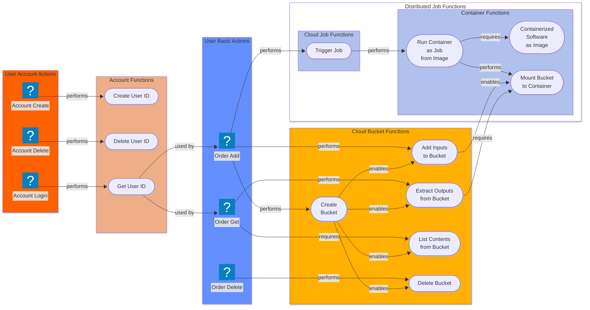

# Figure

## Blueprint System Architecture for a Scientific Computing System

*Caption*: Icons show User Actions. Buttons show internal functions that are performed, required by, enabled, or used
by the subsequent action or function.

